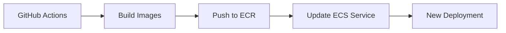

# 🔐 DefectDojo MVP - Credenciais e Acesso

## **Informações de Login**

### **Admin DefectDojo**
```
Username: admin
Password: DefectDojoMVP2024!
Email: admin@defectdojo.local
```

### **Como acessar:**

1. **Após o deploy completo**, vá no AWS Console:
   - EC2 > Instances 
   - Encontre instâncias com tag `Project: defectdojo-mvp`
   - Copie o **Public IP** de uma das instâncias

2. **Acesse no browser:**
   ```
   http://SEU_IP_PUBLICO/
   ```

3. **Para múltiplas instâncias**, teste cada IP até encontrar a que está rodando o serviço.

---

## **Como funciona o Build das Imagens**

### **Processo Automático:**

1. **ECR Repositories** são criados pelo Terraform
2. **GitHub Actions** faz build das imagens da pasta `app/`:
   - `app/Dockerfile.django-alpine` → ECR Django repo
   - `app/Dockerfile.nginx-alpine` → ECR Nginx repo
3. **ECS Task Definition** referencia as imagens automaticamente:
   ```
   image: "${ECR_REPO_URL}:latest"
   ```

### **Fluxo de Deploy:**



---

## **Logs e Troubleshooting**

### **Ver logs da aplicação:**
```bash
# AWS CLI
aws logs describe-log-groups --log-group-name-prefix "/ecs/defectdojo-mvp"

# Ver logs do Django
aws logs get-log-events \
  --log-group-name "/ecs/defectdojo-mvp" \
  --log-stream-name "django/django/TASK_ID"

# Ver logs do Nginx  
aws logs get-log-events \
  --log-group-name "/ecs/defectdojo-mvp" \
  --log-stream-name "nginx/nginx/TASK_ID"
```

### **Verificar ECS Service:**
```bash
# Status do cluster
aws ecs describe-clusters --clusters defectdojo-mvp-cluster

# Status do service
aws ecs describe-services \
  --cluster defectdojo-mvp-cluster \
  --services defectdojo-mvp-service

# Tasks rodando
aws ecs list-tasks --cluster defectdojo-mvp-cluster
```

---

## **Estrutura das Imagens Docker**

### **Django Image** (`app/Dockerfile.django-alpine`):
- **Base**: Python 3.11 Alpine
- **Porta**: 3031 (uWSGI)
- **Variáveis importantes**:
  - `DD_DATABASE_URL` (via SSM)
  - `DD_SECRET_KEY` (via SSM) 
  - `DD_ADMIN_PASSWORD=DefectDojoMVP2024!`

### **Nginx Image** (`app/Dockerfile.nginx-alpine`):
- **Base**: Nginx Alpine
- **Porta**: 8080 → mapeada para 80 no host
- **Função**: Reverse proxy para Django
- **Static files**: Servidos diretamente

---

## **Security Notes (MVP)**

⚠️ **Para MVP apenas:**
- Admin password hardcoded
- Secrets com valores padrão
- Acesso via IP público
- Security groups permissivos

🔒 **Para Produção:**
- Use Application Load Balancer
- Secrets randômicos
- VPC privada
- WAF + SSL/TLS
- RDS em subnet privada

---

## **Roadmap de Testes Atualizado**

### **Fase 1**: Security + ECR ✅
```bash
# GitHub Actions: action=plan, depois action=apply
```

### **Fase 2**: RDS Database 
```bash  
# Descomentar módulo RDS no main.tf
# GitHub Actions: action=apply
```

### **Fase 3**: ECS + Deploy
```bash
# Descomentar módulo ECS no main.tf  
# GitHub Actions: action=apply, build_images=true
```

### **Fase 4**: Acesso
```bash
# Pegar IP público das instâncias EC2
# Acessar http://IP_PUBLICO/
# Login: admin / DefectDojoMVP2024!
```
