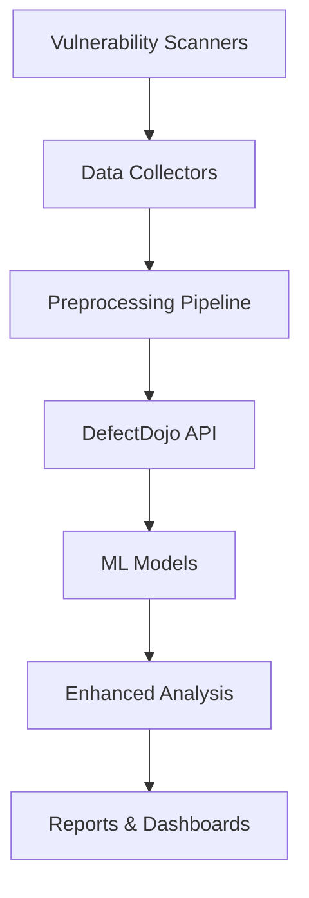
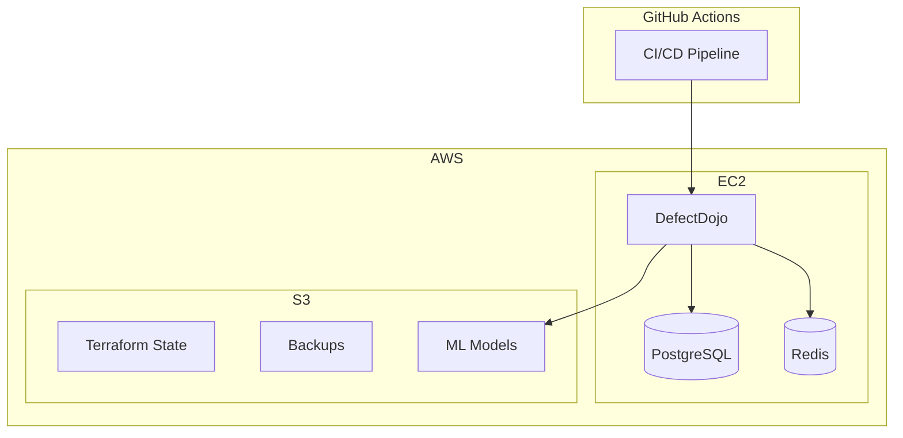

# Arquitetura do Sistema sec-llm-infra

## Visão Geral

O sec-llm-infra é uma plataforma integrada para gestão de segurança que combina DefectDojo, pipelines de dados e modelos de machine learning para análise automatizada de vulnerabilidades.

## Componentes Principais

### 1. Infraestrutura (Terraform + Ansible)
- **AWS EC2**: Servidores de aplicação
- **S3**: Armazenamento de dados e backups
- **Security Groups**: Controle de acesso de rede
- **IAM**: Gestão de identidade e acesso

### 2. DefectDojo
- **Vulnerability Management**: Centralização de vulnerabilidades
- **API Integration**: Integração com scanners
- **Reporting**: Relatórios e dashboards
- **Workflow Management**: Fluxos de aprovação

### 3. Data Pipeline
- **Collectors**: Coleta de dados de scanners
- **Preprocessing**: Normalização e enriquecimento
- **Storage**: Armazenamento estruturado
- **Analysis**: Análise e correlação

### 4. ML Models
- **Training**: Treinamento de modelos
- **Inference**: Predições e classificações
- **Model Management**: Versionamento de modelos

## Fluxo de Dados

## Arquitetura de Deploy

## Segurança

- **Encryption at Rest**: Dados criptografados no S3
- **Encryption in Transit**: HTTPS/TLS para todas as conexões
- **Access Control**: IAM roles com least privilege
- **Network Security**: Security groups restritivos
- **Authentication**: OIDC para CI/CD
- **Monitoring**: Logs centralizados e alertas

## Escalabilidade

- **Horizontal**: Auto Scaling Groups para aumentar capacidade
- **Vertical**: Instâncias maiores para workloads intensivos
- **Storage**: S3 para armazenamento ilimitado
- **Database**: RDS com read replicas para performance

## Monitoramento

- **Application**: DefectDojo metrics
- **Infrastructure**: CloudWatch
- **Logs**: Centralized logging
- **Alerts**: SNS notifications
